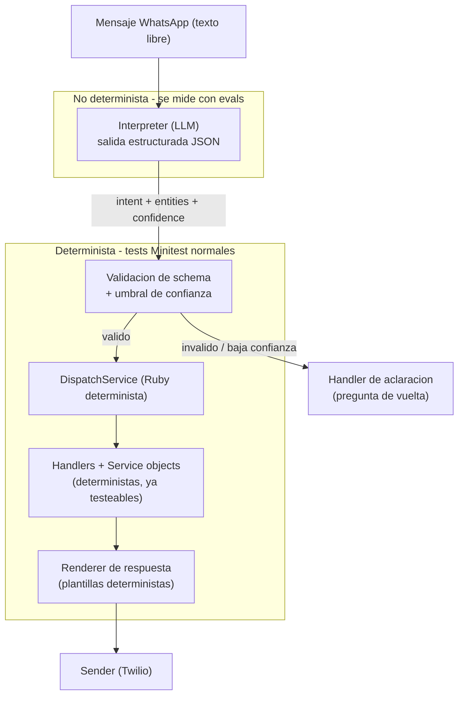

# Cómo testear el agente de WhatsApp para resultados homogéneos

## El principio que lo hace posible: acotar el LLM, no testear su salida cruda

Un LLM es no determinista por naturaleza. No se puede "fijar" su salida como en un test unitario clásico. La homogeneidad se consigue **rediseñando el flujo** para que el LLM tenga la menor responsabilidad posible:

- El LLM **solo interpreta**: convierte el mensaje libre en una estructura tipada `{ intent, entities, confidence }`. No escribe en la BD, no calcula totales, no redacta la respuesta final.
- Todo lo demás (validaciones, cálculos, persistencia, **redacción de la respuesta**) es Ruby determinista y se testea con Minitest normal.

Esto resuelve directamente dos de los tres ejes:
- **Formato uniforme**: las respuestas las renderizan plantillas Ruby deterministas (no el LLM). "Venta a {cliente} por {total}. ¿Confirmo?" sale siempre igual.
- **Correctitud de la acción**: la ejecución vive en service objects deterministas (como los ya existentes `[app/services/sales_orders/record_inventory_exit_service.rb](app/services/sales_orders/record_inventory_exit_service.rb)`), 100% testeables.

El único eje genuinamente no determinista que queda es **la interpretación** (¿entendió bien la intención y extrajo bien los datos?), y eso se mide con evals, no con asserts exactos.

## Arquitectura para testeabilidad

La frontera clave es la salida del `Interpreter`: un contrato JSON tipado (intent enum + entities). Todo lo que está debajo se testea con la suite Minitest existente.

## Tácticas para maximizar consistencia del LLM (antes de testear)

- **Salida estructurada obligatoria**: function calling / JSON schema, no prosa. Permite asserts sobre campos (`intent == "sale"`, `entities.quantity == 10`).
- **`temperature: 0`** (y `seed` fijo si el proveedor lo soporta) para minimizar varianza entre llamadas.
- **System prompt versionado** con el enum de intents, el schema de entities y few-shot examples del dominio (jerga: "fiado", "vendí", "me queda", variantes regionales).
- **Validación + reintento**: si el JSON no cumple el schema, reintentar una vez; si vuelve a fallar, caer al handler de aclaración (nunca ejecutar con datos dudosos).
- **Gate de confirmación**: para toda intención que muta datos (venta/compra/pago), el bot siempre lee de vuelta lo entendido y pide "¿Confirmo?" antes de persistir (ya está en el diseño, `architecture.md` 4.4). Esto acota el daño de cualquier error de interpretación.

## Capa 1 — Tests deterministas (Minitest, corren en cada commit)

Se mockea el `Interpreter` devolviendo estructuras fijas; no se llama al LLM real (sin costo, sin flakiness). Cubren todo lo de abajo de la frontera:

- **Interpreter (con cliente LLM mockeado)**: dado un JSON estructurado, ¿el resto del pipeline hace lo correcto?
- **DispatchService**: cada intent enruta al handler correcto; intent desconocido → handler de aclaración.
- **Handlers + service objects**: flujo principal y errores (stock insuficiente, producto inexistente, permisos por rol vía Pundit).
- **Renderer**: snapshot/strings exactos de cada plantilla de respuesta → garantiza **formato uniforme**.
- **Session multi-turno**: la máquina de estados (`awaiting_customer` → `awaiting_payment_condition`) avanza igual siempre.
- **Webhook integration test**: POST a `/webhooks/whatsapp` con `Interpreter` mockeado, verifica respuesta y efectos en BD.

Estos entran en el job `test` del CI actual (`[.github/workflows/ci.yml](.github/workflows/ci.yml)`, `bin/rails db:test:prepare test`) sin cambios de infraestructura.

## Capa 2 — Evals del LLM (suite con puntaje, fuera del pipeline bloqueante)

Aquí sí se llama al modelo real para medir la calidad de interpretación. No es pass/fail por caso (un LLM puede fallar 1 de 100 y estar bien); es una **suite puntuada** con umbrales.

- **Golden dataset** (`test/evals/cases/*.yml`): pares `mensaje → interpretación esperada`, agrupados por categoría: ventas, compras, pagos, consultas inventario, reportes, desconocido, ambiguos, multi-turno, adversariales (typos, jerga, mezcla español regional).
- **Métricas de homogeneidad**:
  - *Correctitud*: accuracy de intent + exact-match/F1 de extracción de entities.
  - *Consistencia*: correr cada caso **N veces** (ej. 10) y medir tasa de acuerdo (ej. "mismo intent ≥ 95% de las corridas"). Esta es la métrica directa de "resultados homogéneos".
  - *Formato*: como la respuesta la arma Ruby, basta verificar que dado el intent correcto, el render coincide (cubierto en Capa 1).
- **Ejecución**: rake task `bin/rails eval:run` que imprime el scorecard. Corre on-demand y/o en un job nightly de GitHub Actions (separado, con `OPENAI_API_KEY`/`ANTHROPIC_API_KEY` como secret), **no en cada PR** (costo + variabilidad).
- **Gate de regresión**: el eval falla si el puntaje cae bajo un umbral (ej. intent accuracy < 90% o consistencia < 95%), para detectar regresiones al cambiar prompt o modelo.

## Reproducibilidad en CI: record & replay

Para que los integration tests del webhook sean reproducibles sin pegarle al LLM en CI, grabar las respuestas del modelo (estilo VCR/cassettes) y reproducirlas. Los evals con modelo real viven solo en el job nightly.

## Resumen de la respuesta a tu pregunta

"Homogéneo" se logra en capas:
- **Formato** y **correctitud de ejecución** → 100% determinista, tests Minitest normales (la parte grande y barata).
- **Correctitud de interpretación** → evals puntuados contra un golden set.
- **Consistencia entre corridas** → temperature 0 + salida estructurada + medición de tasa de acuerdo con N repeticiones.
- **Red de seguridad** → gate de confirmación + fallback a aclaración cuando la confianza es baja.