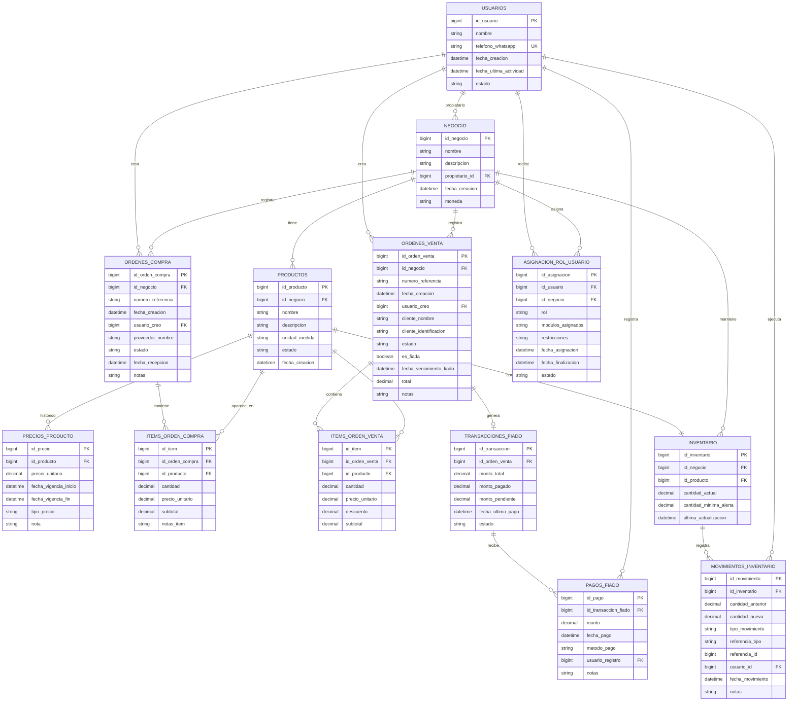

# Arquitectura de Software - Sistema de Gestión Comercial para Pequeños Negocios

## 1. Definición de Entidades (Modelo de Datos Normalizado)

### 1.1 Entidades Principales

#### **Usuarios**
```
- id_usuario (PK)
- nombre
- teléfono_whatsapp (único)
- fecha_creación
- fecha_última_actividad
- estado (activo, inactivo)
```

#### **Negocio**
```
- id_negocio (PK)
- nombre
- descripción
- propietario_id (FK → Usuarios)
- fecha_creación
- moneda (COP, USD, etc.)
```

#### **Productos**
```
- id_producto (PK)
- id_negocio (FK)
- nombre
- descripción
- unidad_medida (kg, unidad, litro, etc.)
- estado (activo, inactivo)
- fecha_creación
```

#### **Precios_Producto**
```
- id_precio (PK)
- id_producto (FK)
- precio_unitario
- fecha_vigencia_inicio
- fecha_vigencia_fin
- tipo_precio (compra, venta)
- nota (para cambios de precio)
```

**Razón:** Separar precios de productos permite histórico de cambios sin afectar registros anteriores.

#### **Órdenes_Compra**
```
- id_orden_compra (PK)
- id_negocio (FK)
- número_referencia (único por negocio)
- fecha_creación
- usuario_creó (FK → Usuarios)
- proveedor_nombre
- estado (pendiente, recibida, parcial, cancelada)
- fecha_recepción
- notas
```

#### **Items_Orden_Compra**
```
- id_item (PK)
- id_orden_compra (FK)
- id_producto (FK)
- cantidad
- precio_unitario (snapshot del precio)
- subtotal (cantidad × precio_unitario)
- notas_item
```

**Razón:** Snapshot del precio permite auditoría; si cambia precio después, queda registrado.

#### **Órdenes_Venta**
```
- id_orden_venta (PK)
- id_negocio (FK)
- número_referencia (único por negocio)
- fecha_creación
- usuario_creó (FK → Usuarios)
- cliente_nombre
- cliente_identificación (opcional)
- estado (pendiente, completada, fiada, cancelada)
- es_fiada (boolean)
- fecha_vencimiento_fiado (si aplica)
- total
- notas
```

#### **Items_Orden_Venta**
```
- id_item (PK)
- id_orden_venta (FK)
- id_producto (FK)
- cantidad
- precio_unitario (snapshot)
- descuento (% o monto)
- subtotal
```

#### **Transacciones_Fiado**
```
- id_transacción (PK)
- id_orden_venta (FK)
- monto_total
- monto_pagado
- monto_pendiente
- fecha_último_pago
- historial_pagos (referencia a tabla de pagos)
- estado (activa, cancelada, vencida)
```

#### **Pagos_Fiado**
```
- id_pago (PK)
- id_transacción_fiado (FK)
- monto
- fecha_pago
- método_pago (efectivo, transferencia, otro)
- usuario_registró (FK)
- notas
```

#### **Inventario**
```
- id_inventario (PK)
- id_negocio (FK)
- id_producto (FK)
- cantidad_actual
- cantidad_mínima_alerta
- última_actualización
```

**Razón:** Permite alertar cuando falta stock.

#### **Movimientos_Inventario**
```
- id_movimiento (PK)
- id_inventario (FK)
- cantidad_anterior
- cantidad_nueva
- tipo_movimiento (entrada_compra, salida_venta, ajuste, otro)
- referencia_id (id_orden_compra o id_orden_venta)
- usuario_id (FK)
- fecha_movimiento
- notas
```

**Razón:** Auditoría completa de cambios.

### 1.2 Diagrama de Relaciones Conceptual

```
Negocio (1) ──┬─→ (M) Usuarios
              ├─→ (M) Productos
              ├─→ (M) Órdenes_Compra
              ├─→ (M) Órdenes_Venta
              └─→ (M) Inventario

Productos (1) ──┬─→ (M) Precios_Producto
                ├─→ (M) Items_Orden_Compra
                ├─→ (M) Items_Orden_Venta
                └─→ (1) Inventario

Órdenes_Compra (1) ──→ (M) Items_Orden_Compra
Órdenes_Venta (1) ──┬─→ (M) Items_Orden_Venta
                    └─→ (1) Transacciones_Fiado

Transacciones_Fiado (1) ──→ (M) Pagos_Fiado
```

### 1.3 Diagrama ER en Mermaid



---

## 2. Estructura de Roles y Permisos

### 2.1 Roles Definidos

#### **Propietario (OWNER)**
- Crear negocios
- Crear y eliminar gestores
- Asignar roles y módulos desde portal web
- Ver todos los reportes
- Configurar alertas de inventario
- Gestionar usuarios del negocio
- Definir rangos de precios permitidos
- Aprobar cambios grandes de inventario

#### **Gestor (MANAGER)**
- Registrar órdenes de compra
- Registrar órdenes de venta
- Registrar pagos de fiado
- Ver reportes básicos (los asignados)
- Actualizar inventario
- NO puede: eliminar registros, cambiar precios globales, crear gestores

#### **Operario (OPERATOR)**
- Registrar órdenes de venta (si está asignado a módulo de ventas)
- Registrar órdenes de compra (si está asignado a módulo de compras)
- Ver resumen de su actividad
- NO puede: ver reportes financieros, cambiar inventario sin supervisor, acceder a fiados

#### **Visualizador (VIEWER)**
- Solo lectura de reportes asignados
- NO puede: registrar nada, cambiar datos

### 2.2 Matriz de Permisos

| Permiso | OWNER | MANAGER | OPERATOR | VIEWER |
|---------|-------|---------|----------|--------|
| Crear negocio | ✓ | ✗ | ✗ | ✗ |
| Crear gestor | ✓ | ✗ | ✗ | ✗ |
| Registrar compra | ✓ | ✓ | ✓* | ✗ |
| Registrar venta | ✓ | ✓ | ✓* | ✗ |
| Registrar fiado | ✓ | ✓ | ✗ | ✗ |
| Registrar pago fiado | ✓ | ✓ | ✗ | ✗ |
| Actualizar inventario | ✓ | ✓ | ✗ | ✗ |
| Ver reportes | ✓ | ✓** | ✓** | ✓** |
| Cambiar precios | ✓ | ✗ | ✗ | ✗ |
| Eliminar registros | ✓ | ✗ | ✗ | ✗ |

*Con restricción de monto o rango  
**Solo los asignados

### 2.3 Asignación de Usuarios a Funciones

```
Entidad: Asignación_Rol_Usuario
- id_asignación (PK)
- id_usuario (FK)
- id_negocio (FK)
- rol (OWNER, MANAGER, OPERATOR, VIEWER)
- módulos_asignados (compras, ventas, inventario, reportes, fiado)
- restricciones (ej: monto máximo, categorías de productos)
- fecha_asignación
- fecha_finalización (NULL si vigente)
- estado (activa, suspendida)
```

---

## 3. Reportes Predefinidos

### 3.1 Reportes para Propietarios/Gerentes

#### **Reporte 1: Dashboard Diario**
- Ventas totales del día
- Compras totales del día
- Número de órdenes fiadas
- Monto pendiente de cobro (fiado)
- Top 5 productos vendidos
- Alertas de inventario bajo
- Ingresos vs egresos (síntesis)

#### **Reporte 2: Estado de Fiados**
- Lista de clientes con deuda
- Monto adeudado por cliente
- Días vencidos
- Historial de pagos del cliente
- Órdenes asociadas
- Proyección de cobranza

#### **Reporte 3: Análisis de Inventario**
- Productos con stock bajo (vs cantidad mínima)
- Productos con alto stock
- Rotación de inventario (en/salidas últimos 30 días)
- Valor total de inventario
- Productos con movimiento cero
- Sugerencias de compra

#### **Reporte 4: Rentabilidad por Producto**
- Margen por producto (venta promedio - compra promedio)
- Volumen vendido vs volumen comprado
- Productos más rentables
- Productos con margen bajo
- Comparativa período anterior

#### **Reporte 5: Movimientos Mensuales**
- Resumen de compras por proveedor
- Resumen de ventas (total y por cliente)
- Montos por cobrar (fiado)
- Pagos realizados en el mes
- Crecimiento/decrecimiento vs mes anterior

#### **Reporte 6: Auditoría y Trazabilidad**
- Cambios de precios (cuándo, quién, cuánto)
- Ajustes de inventario (quién, cuándo, por qué)
- Órdenes canceladas
- Cambios en fiados (abonos, condonaciones)
- Usuarios con más actividad

#### **Reporte 7: Vista Contable (Web)**
- Estado de resultados simplificado (ingresos, costos, utilidad)
- Flujo de caja del período
- Cuentas por cobrar (fiados) y por pagar (compras pendientes)
- Gastos operativos categorizados
- Comparativo mensual de ingresos vs egresos
- Exportación a Excel/PDF

### 3.2 Reportes para Operarios/Visualizadores

#### **Reporte Actividad Personal**
- Órdenes que creé hoy/esta semana
- Total vendido por mí
- Comisiones (si aplica)
- Productos más vendidos por mí

#### **Reporte Resumen Operativo**
- Stock actual
- Órdenes pendientes
- Clientes por cobrar (si tiene permiso)

---

## 4. Flujo de Uso - Interacción WhatsApp + Web

### 4.1 Arquitectura de Conversación

El sistema opera con **dos canales de interacción**:

1. **WhatsApp** para registro operativo rápido (compras, ventas, pagos, consultas).
2. **Portal Web** para administración (roles/permisos) y visualización contable.

Flujo conversacional en WhatsApp con capacidad de interpretación de contexto:

```
Usuario → Mensaje WhatsApp → Bot (Multimodal)
              ↓
        Interpreta intención
        (texto, imagen, número)
              ↓
        Valida permisos del usuario
              ↓
        Ejecuta acción o solicita confirmación
              ↓
        Responde y registra en BD
```

### 4.2 Flujos Principales

#### **Flujo 1: Registrar Orden de Compra**

```
Usuario: "Hola, recibí una compra de insumos"

Bot: "Bienvenido [Nombre]. Entiendo que registramos una compra.
¿Cuál es el nombre del proveedor?"

Usuario: "Supermercado Juanito"

Bot: "Perfecto. ¿Qué productos compraste? Puedes:
- Escribir: 'arroz 50kg a $50000'
- Enviar foto del recibo
- Escribir cada producto por separado"

Usuario: [Envía foto del recibo]

Bot: [Analiza imagen con OCR]
"Detecté:
- Arroz 50kg: $50,000
- Aceite 5L: $80,000
- Sal 2kg: $5,000

¿Es correcto?"

Usuario: "Sí, pero son 2 bolsas de arroz"

Bot: "Actualizado:
- Arroz 50kg (x2): $100,000
- Aceite 5L: $80,000
- Sal 2kg: $5,000
Total: $185,000

¿Procedo a registrar?"

Usuario: "Sí"

Bot: "✅ Compra registrada [REF-2024-001]
Stock actualizado:
- Arroz: 150kg → 200kg
- Aceite: 25L → 30L
- Sal: 30kg → 32kg"
```

#### **Flujo 2: Registrar Orden de Venta**

```
Usuario: "Necesito vender 10kg de arroz"

Bot: "¿A quién? (nombre cliente o 'venta general')"

Usuario: "Don Julio"

Bot: "Perfecto, Don Julio.
10kg de arroz: $[precio_actual]/kg
Total: $[subtotal]

¿Es al contado o es fiado?"

Usuario: "Fiado, para el viernes"

Bot: "Entendido. Vendida fiada hasta viernes.
✅ Orden registrada [VEN-2024-042]
Stock: 200kg → 190kg
Pendiente de cobro: $[subtotal]"
```

#### **Flujo 3: Registrar Pago de Fiado**

```
Usuario: "Don Julio pagó hoy"

Bot: "¿Cuánto pagó Don Julio?"

Usuario: "$50000"

Bot: "Don Julio adeuda $[total].
Recibió pago: $50,000
Nuevo saldo: $[pendiente]

¿Está correcta la información?"

Usuario: "Sí"

Bot: "✅ Pago registrado
Deuda Don Julio: $[pendiente] para el viernes"
```

#### **Flujo 4: Consultar Inventario**

```
Usuario: "¿Cuánto arroz tengo?"

Bot: "Arroz: 190kg
Mínimo sugerido: 100kg
Estado: ✅ Normal (sobre mínimo)"

Usuario: "¿Y qué está bajo?"

Bot: "⚠️ Productos bajo stock:
- Aceite: 5L (mínimo: 10L)
- Sal: 8kg (mínimo: 10kg)

¿Deseas registrar una compra?"
```

#### **Flujo 5: Pedir Reporte**

```
Usuario: "Dame reporte de hoy"

Bot: "¿Qué reporte necesitas?
1️⃣ Dashboard (ventas, compras, fiados)
2️⃣ Rentabilidad
3️⃣ Fiados pendientes
4️⃣ Inventario
5️⃣ Actividad personal"

Usuario: "1"

Bot: [Genera reporte]
"📊 Dashboard - 14 de Junio

Ventas: $[total]
Compras: $[total]
Fiados nuevos: $[total]
Pendiente de cobro: $[total]
⚠️ Stock bajo: [cantidad productos]

¿Necesitas más detalles?"
```

### 4.3 Capacidades de Interpretación Multimodal

El bot puede:

1. **Procesar texto natural**
   - "Vendí 5 kilos de arroz"
   - "Cobré $50000 a don julio"
   - "¿Cuánto arroz me queda?"

2. **Procesar imágenes**
   - Foto de recibo → extrae productos, cantidades, precios
   - Foto de lista manuscrita → OCR + estructura
   - Foto de producto → identifica (opcional)

3. **Procesar números y contexto**
   - "50" después de "arroz" → cantidad
   - "Juan" + context = cliente conocido
   - "Ayer" = fecha relativa

4. **Desambigüación inteligente**
   - Si usuario dice "arroz" pero hay 3 tipos → pregunta cuál
   - Si precio parece muy alto/bajo → confirma
   - Si moneda no coincide → advierte

### 4.4 Estados y Confirmación

Cada acción importante requiere:
1. **Lectura** - Bot repite lo que entendió
2. **Validación** - Usuario confirma o corrige
3. **Ejecución** - Se registra
4. **Confirmación** - Bot muestra resultado y referencia

```
Usuario Input
     ↓
Bot: ¿Esto es correcto? [resumen]
     ↓
Usuario: Sí/No/Corrige
     ↓
Acción o corrección
     ↓
Resultado con referencia
```

### 4.5 Errores y Recuperación

```
Usuario: "Vendí 1000 kilos de arroz"

Bot: "⚠️ Eso es más del stock disponible (190kg).
¿Es correcto o hubo error?"

Usuario: "Error, son 10 kilos"

Bot: "10kg está dentro del stock. ✅ Procedo"
```

### 4.6 Sesión Multi-usuario

Cada usuario ve solo lo de su negocio:

```
Usuario A (Gestor): "¿Qué compré esta semana?"
Bot: [Muestra órdenes de Negocio A]

Usuario B (Operario diferente): "¿Qué compré?"
Bot: [Muestra solo si usuario B tiene permiso]
     [Filtra por su negocio]
```

### 4.7 Notificaciones Proactivas (Programadas)

El bot puede enviar alertas sin que el usuario pregunte:

```
Bot → [Propietario]
"📢 Alerta de inventario:
- Aceite bajo (5L, mínimo 10L)
- No hay movimiento de Sal hace 7 días

¿Qué quieres hacer?"
```

```
Bot → [Gestor]
"⏰ Recordatorio de fiados:
- Don Julio vence HOY ($50,000)
- Doña María vence MAÑANA ($30,000)

Necesitamos cobrar 🔔"
```

### 4.8 Flujo Web: Asignación de Roles y Visualización Contable

#### **Flujo 6: Asignación de Roles desde Portal Web**

```
Usuario (OWNER/MANAGER autorizado) ingresa al portal web
     ↓
Selecciona usuario del negocio
     ↓
Define rol, módulos y restricciones
     ↓
Sistema valida permisos del solicitante
     ↓
Guarda en Asignación_Rol_Usuario + auditoría
     ↓
Confirma cambios y aplica permisos en tiempo real
```

#### **Flujo 7: Visualización Contable en Web**

```
Usuario (OWNER/MANAGER) abre módulo contable
     ↓
Selecciona período (hoy, semana, mes, personalizado)
     ↓
Sistema consolida ventas, compras, pagos y fiados
     ↓
Muestra tableros: ingresos, egresos, utilidad, caja y cuentas por cobrar/pagar
     ↓
Usuario filtra o exporta reporte (Excel/PDF)
```

---

## 5. Consideraciones Técnicas (Arquitectura Lógica, no implementación)

### 5.1 Capas Lógicas

```
┌─────────────────────────────────────┐
│   Capa de Presentación              │
│   - WhatsApp Bot Interface          │
│   - Portal Web Administrativo       │
│     (roles, permisos, contabilidad) │
└────────────┬────────────────────────┘
             │
┌────────────▼────────────────────────┐
│   Capa de Aplicación                │
│   - Parser de lenguaje natural      │
│   - Gestor de permisos              │
│   - Orquestador de flujos           │
│   - Procesador de imágenes/OCR      │
│   - API web de administración        │
│   - API de reportes contables        │
└────────────┬────────────────────────┘
             │
┌────────────▼────────────────────────┐
│   Capa de Lógica de Negocio         │
│   - Validaciones                    │
│   - Cálculos (margen, fiado, etc)   │
│   - Generador de reportes           │
│   - Gestor de alertas               │
│   - Consolidador contable            │
└────────────┬────────────────────────┘
             │
┌────────────▼────────────────────────┐
│   Capa de Acceso a Datos            │
│   - Queries                         │
│   - Transacciones                   │
│   - Caché de precios/inventario     │
└────────────┬────────────────────────┘
             │
┌────────────▼────────────────────────┐
│   Base de Datos                     │
│   (Entidades normalizadas)          │
└─────────────────────────────────────┘
```

### 5.2 Flujo de Datos para Orden de Venta

```
Usuario (WhatsApp)
    │
    ↓ (mensaje + media)
┌─────────────────────────┐
│ Parser Multimodal       │ ← Extrae: producto, cantidad, cliente, precio
└────────┬────────────────┘
         │
         ↓
┌─────────────────────────┐
│ Validador Permisos      │ ← ¿Usuario puede vender?
└────────┬────────────────┘
         │
         ↓
┌─────────────────────────┐
│ Validador Datos         │ ← ¿Producto existe? ¿Stock?
└────────┬────────────────┘
         │
         ↓
┌─────────────────────────┐
│ Constructor de Orden    │ ← Crea snapshot de precios
└────────┬────────────────┘
         │
         ↓
┌─────────────────────────┐
│ Persistidor             │ ← Transacción: inserta orden + items + inventario
└────────┬────────────────┘
         │
         ↓
┌─────────────────────────┐
│ Notificador             │ ← Envía confirmación a usuario
└─────────────────────────┘
```

### 5.3 Requisitos No-Funcionales

- **Disponibilidad**: 99.5% (pequeño negocio, puede tener downtime)
- **Latencia**: < 3 segundos por interacción
- **Consistencia**: ACID para transacciones de dinero
- **Auditoría**: Cada cambio registra usuario, fecha, acción
- **Privacidad**: Cada usuario ve solo su negocio
- **Escalabilidad**: Debe soportar 50-100 usuarios por negocio, múltiples negocios

---

## 6. Resumen Ejecutivo

| Aspecto | Descripción |
|--------|------------|
| **Entidades** | 12 tablas normalizadas: usuarios, productos, órdenes (compra/venta), inventario, fiados, pagos |
| **Normalización** | Precios históricos, snapshots en transacciones, movimientos de inventario con auditoría |
| **Roles** | 4 niveles: Propietario, Gestor, Operario, Visualizador |
| **Permisos** | Matriz con restricciones por rol (monto máximo, módulos) |
| **Reportes** | 7+ reportes predefinidos: dashboard, fiados, inventario, rentabilidad, auditoría, contabilidad |
| **Interfaz** | WhatsApp conversacional + Portal Web (roles/permisos y contabilidad) + OCR para imágenes |
| **Flujos** | Compra, venta, fiado, pago fiado, consulta, reportes, alertas, asignación web de roles, vista contable web |
| **Arquitectura** | 5 capas: presentación multicanal, aplicación, lógica, datos, BD |
| **Multimodal** | Texto, números, imágenes, contexto relativo (hoy, ayer) |

---

**Próximos pasos:** Definir tecnologías específicas, infraestructura, y comenzar con MVP de módulo de ventas.
