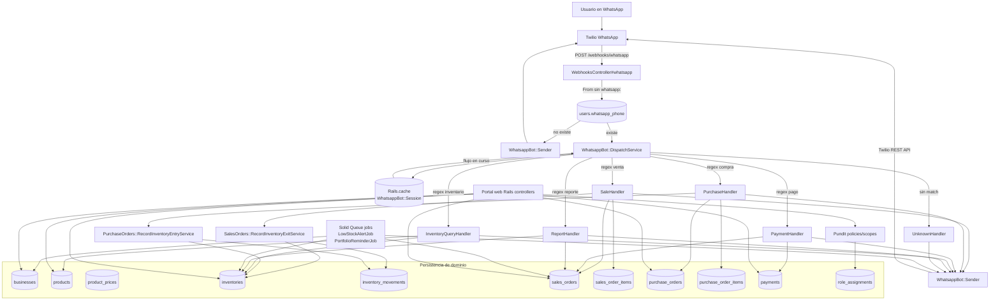
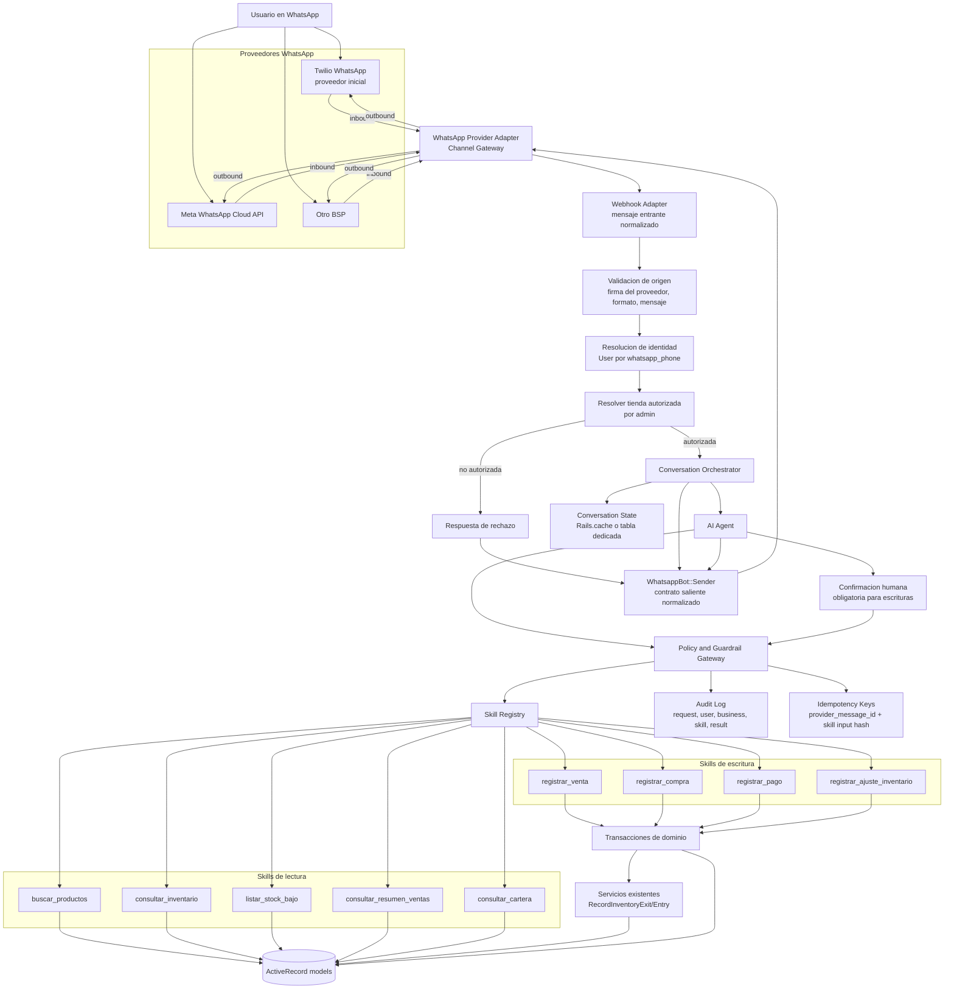

# Evolucion de WhatsApp hacia AI Agent para registros de BD

Este documento resume la integracion actual de WhatsApp en Hermes y propone una evolucion incremental para incorporar un agente de AI que pueda operar registros de base de datos mediante skills controladas. La propuesta mantiene compatibilidad con el bot existente y restringe las operaciones a pedidos de tiendas autorizadas por un administrador.

## Estructura actual

La integracion actual usa Twilio como canal de entrada y salida. Twilio envia los mensajes entrantes a `POST /webhooks/whatsapp`; `WebhooksController#whatsapp` normaliza `params[:From]`, busca `User.whatsapp_phone` y delega el texto a `WhatsappBot::DispatchService`.

`DispatchService` identifica intenciones por expresiones regulares y usa `WhatsappBot::Session` sobre `Rails.cache` para continuar flujos multi-mensaje. Los handlers actuales cubren ventas, compras, pagos, consultas de inventario, reportes y fallback. Las escrituras principales se hacen directamente desde los handlers contra ActiveRecord y, para movimientos de inventario, reutilizan `SalesOrders::RecordInventoryExitService` y `PurchaseOrders::RecordInventoryEntryService`.

El portal web expone CRUDs Rails para negocios, productos, inventarios, ordenes de compra, ordenes de venta, pagos y movimientos. Esos endpoints ya pasan por Devise y Pundit (`DomainResourcePolicy`), pero el webhook de WhatsApp salta autenticacion web, CSRF y verificacion Pundit; su autorizacion real hoy depende de encontrar el usuario por telefono y de que `BaseHandler` toma `user.owned_businesses.first` como negocio operativo. Los jobs `LowStockAlertJob` y `PortfolioReminderJob` tambien usan `WhatsappBot::Sender` para notificaciones salientes a los owners.

## Diagrama de arquitectura actual

## Arquitectura objetivo

La evolucion recomendada no reemplaza el webhook ni los servicios de dominio de una vez. El cambio principal es insertar una capa de orquestacion entre WhatsApp y las escrituras: un agente de AI interpreta el pedido, selecciona skills permitidas y nunca escribe directamente sin pasar por autorizacion, validacion, idempotencia y auditoria.

Twilio debe quedar como proveedor inicial de WhatsApp, pero no como una dependencia directa del agente ni del dominio. La arquitectura objetivo agrega un `WhatsApp Provider Adapter` o `Channel Gateway` que normaliza entradas y salidas para que el sistema pueda migrar a WhatsApp Cloud API de Meta u otro BSP sin tocar el AI Agent, las skills, auditoria, idempotencia ni servicios de dominio.

### Principios de la arquitectura objetivo

- El agente decide la intencion y arma parametros, pero las skills son la unica superficie para leer o escribir datos.
- Cada skill recibe `user`, `business`, `input`, `message_id` y `conversation_id`; ninguna skill debe inferir el negocio desde `owned_businesses.first`.
- La tienda operativa debe resolverse de forma explicita: seleccion del usuario, default administrado o metadata de autorizacion. Si hay ambiguedad, el agente pregunta antes de actuar.
- El admin autoriza que una tienda pueda recibir pedidos por WhatsApp/AI y que usuarios concretos puedan operar esa tienda. Esa autorizacion debe validarse antes de cualquier skill.
- Las escrituras requieren confirmacion conversacional y deben ejecutarse dentro de transacciones, reutilizando servicios de dominio donde existan.
- Twilio es el proveedor inicial, pero todo codigo de AI Agent, skills, auditoria, idempotencia y dominio debe depender de contratos normalizados del canal, no de parametros, firmas o clientes REST especificos de Twilio.

## Skills propuestas

Las skills deben replicar capacidades de endpoints existentes sin exponer todo el CRUD de forma libre. Conviene empezar por operaciones de alto valor y bajo riesgo, separadas entre lectura y escritura.

| Skill | Tipo | Capacidad equivalente | Guardrails minimos |
| --- | --- | --- | --- |
| `buscar_productos` | Lectura | `ProductsController#index/show` | Scope por tienda autorizada, solo productos activos por defecto. |
| `consultar_inventario` | Lectura | `InventoriesController#index/show` | Scope por tienda, busqueda exacta o fuzzy limitada, sin cambios de stock. |
| `listar_stock_bajo` | Lectura | `InventoryQueryHandler` y `LowStockAlertJob` | Solo inventarios de la tienda autorizada, limites de paginacion. |
| `consultar_resumen_ventas` | Lectura | `ReportHandler` y `SalesOrdersController#index` | Rangos de fecha permitidos, agregados por tienda, sin datos de otras tiendas. |
| `consultar_cartera` | Lectura | `PortfolioReminderJob` y `SalesOrdersController#index` | Solo ventas a credito de la tienda, filtros por cliente y estado. |
| `registrar_venta` | Escritura | `SalesOrdersController#create` + `RecordInventoryExitService` | Confirmacion requerida, Pundit `create?`, stock suficiente, clave idempotente, auditoria. |
| `registrar_compra` | Escritura | `PurchaseOrdersController#create` + `RecordInventoryEntryService` | Confirmacion requerida, proveedor/producto validados, transaccion, auditoria. |
| `registrar_pago` | Escritura | `PaymentsController#create` | Confirmacion requerida, venta de credito pendiente de la misma tienda, monto valido, no duplicar pagos. |
| `registrar_ajuste_inventario` | Escritura sensible | `InventoryMovementsController#create` / ajuste futuro | Solo owner/manager o modulo autorizado, motivo obligatorio, auditoria reforzada. |

### Guardrails comunes

- Tienda autorizada por admin: agregar una fuente explicita de autorizacion para uso del agente por tienda. Puede ser una tabla dedicada como `ai_agent_business_authorizations` o un campo/metadata administrado en `Business`, siempre validado server-side antes de invocar skills.
- Usuario autorizado: combinar `User#can_access_business?`, `RoleAssignment.status == "active"` y permisos por modulo (`assigned_modules`) antes de cada skill.
- Separacion lectura/escritura: el agente puede ejecutar skills de lectura para desambiguar; las skills de escritura requieren confirmacion del usuario con un resumen de efectos.
- Auditoria: registrar mensaje original, telefono normalizado, usuario, tienda, skill, parametros normalizados, resultado, errores, IDs creados y timestamps.
- Idempotencia: usar el ID estable del proveedor (`MessageSid` de Twilio al inicio, o el identificador equivalente de Meta/BSP) y combinarlo con nombre de skill y hash de parametros normalizados. Si el mismo mensaje se reintenta, devolver el resultado anterior sin duplicar ordenes o pagos.
- Validacion de dominio: no confiar en el texto parseado por AI. Las skills deben validar productos, cantidades, precios, estados, stock, ventas pendientes y pertenencia a la tienda.
- Menor privilegio: las skills no deben recibir modelos arbitrarios ni SQL; deben exponer contratos estrechos, versionados y testeables.
- Confirmacion y cancelacion: para escrituras, mantener el flujo actual de draft en sesion, pero guardar un payload normalizado que la skill ejecutara solo despues del "si/confirmo".

## Desacoplamiento de Twilio y reduccion de costos

La capa de proveedor debe permitir descartar Twilio cuando haya una alternativa mas economica o conveniente, sin redisenar la conversacion ni las capacidades de negocio. Para lograrlo, el webhook debe transformar cada payload externo en un contrato interno como `InboundWhatsappMessage` con `provider`, `provider_message_id`, `from`, `to`, `body`, `media`, `received_at`, `raw_payload` y metadatos de validacion. De la misma forma, `WhatsappBot::Sender` deberia hablar con un contrato saliente como `OutboundWhatsappMessage` y delegar en el adapter activo para Twilio, Meta Cloud API u otro BSP.

La transicion debe ser reversible y observable:

- Mantener Twilio como proveedor inicial mientras se mide costo, tasa de entrega, latencia, errores por proveedor y reintentos.
- Preservar idempotencia con IDs del proveedor y hashes normalizados, no con clases o parametros especificos de Twilio.
- Desacoplar el sender para que jobs, orquestador y agente emitan mensajes salientes sin conocer el cliente REST del proveedor.
- Activar proveedor por feature flag y, si aplica, por tienda para migrar cohortes pequenas antes de mover todo el trafico.
- Permitir convivencia temporal: algunas tiendas o tipos de mensaje por Twilio y otras por Meta/BSP, con auditoria indicando proveedor usado.
- Comparar metricas de costo por conversacion/mensaje, entrega, fallos, reintentos y tiempo de respuesta antes de cambiar el default.
- Definir rollback simple: volver el flag de la tienda/proveedor a Twilio y conservar los mismos contratos internos, claves idempotentes y trazas.

## Fases de implementacion

### Fase 1: endurecer el webhook actual

- Validar firma/origen de Twilio y capturar `MessageSid` como `provider_message_id` para idempotencia.
- Introducir contratos internos de mensaje entrante/saliente aunque Twilio siga siendo el unico adapter implementado.
- Reemplazar `user.owned_businesses.first` por un resolver explicito de tienda autorizada.
- Agregar una capa de autorizacion para WhatsApp que reutilice Pundit o un gateway equivalente antes de cada handler.
- Registrar auditoria basica de mensajes entrantes, handler elegido, negocio, resultado y errores.

### Fase 2: extraer skills sin AI

- Convertir las operaciones actuales de handlers en objetos de skill con contratos claros (`call(user:, business:, input:, idempotency_key:)`).
- Mantener `DispatchService` por regex, pero hacer que invoque skills en lugar de escribir directamente.
- Reutilizar `RecordInventoryExitService` y `RecordInventoryEntryService` para preservar comportamiento de inventario.
- Cubrir con tests los permisos por tienda, idempotencia y separacion lectura/escritura.

### Fase 3: introducir AI Agent como orquestador

- Insertar el agente detras de una bandera de feature por tienda autorizada.
- Usar el agente para parsear intenciones y parametros, pero ejecutar solo skills registradas.
- Mantener fallback al dispatcher por regex si el agente no puede resolver una intencion con confianza.
- Exigir confirmacion humana para cualquier escritura y guardar el draft normalizado antes de ejecutar.

### Fase 4: estandarizar con endpoints y dominio compartido

- Alinear controllers web y skills sobre servicios de aplicacion comunes para evitar reglas duplicadas.
- Versionar contratos de skills como una API interna.
- Agregar trazabilidad completa entre mensaje WhatsApp, skill, registros creados y movimientos de inventario.
- Ampliar gradualmente las skills a capacidades nuevas solo cuando tengan policy, auditoria e idempotencia.
- Evaluar cambio de proveedor con feature flags por tienda, convivencia temporal y rollback documentado antes de retirar Twilio.

## Compatibilidad con la estructura actual

La evolucion puede convivir con `WhatsappBot::DispatchService` y los handlers actuales durante la migracion. El primer paso no necesita cambiar Twilio ni la ruta publica; basta con insertar componentes internos entre el proveedor WhatsApp y las escrituras. Los jobs existentes pueden seguir usando `WhatsappBot::Sender`, pero ese sender deberia convertirse en una fachada sobre el adapter activo para que las notificaciones salientes tambien puedan moverse de Twilio a Meta Cloud API u otro BSP con auditoria consistente.

El mayor ajuste conceptual es tratar WhatsApp como otro cliente autorizado del dominio, no como una ruta especial que escribe directo. Las skills deberian convertirse en la frontera estable para que tanto el dispatcher actual como el AI Agent ejecuten las mismas capacidades bajo las mismas reglas.
