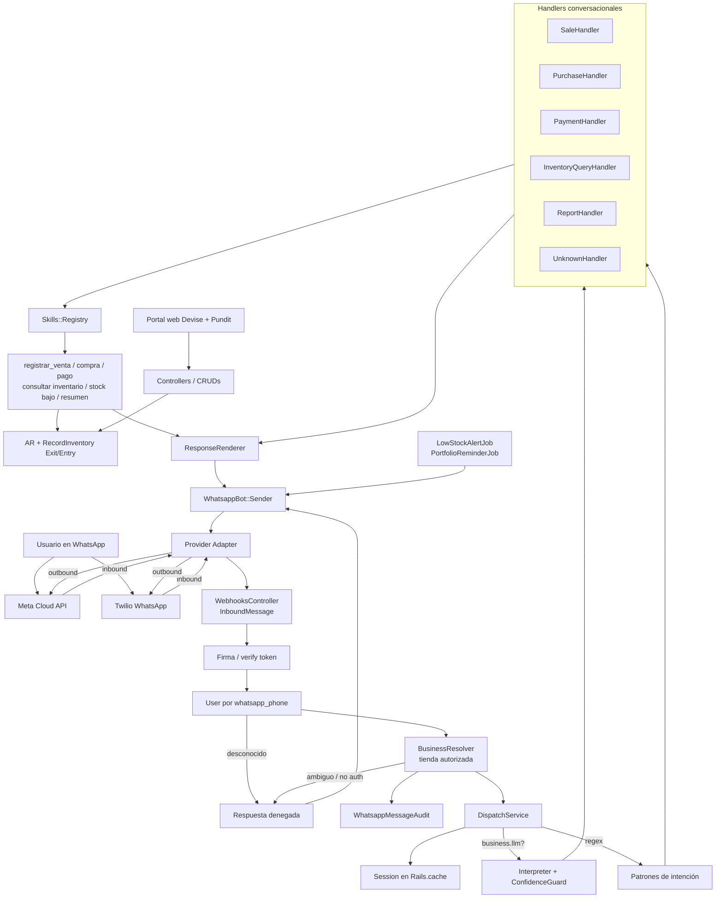
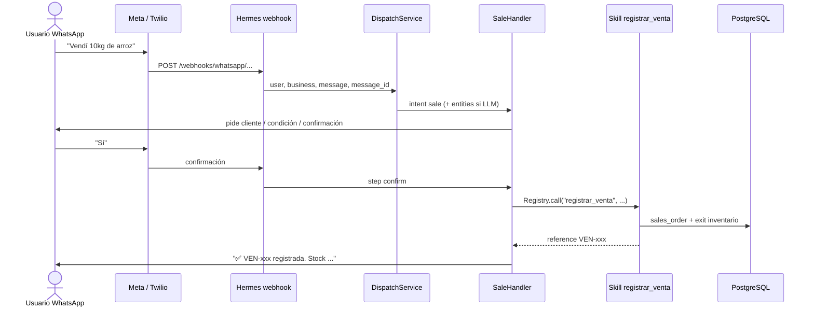
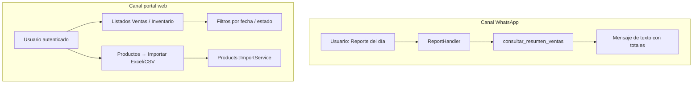
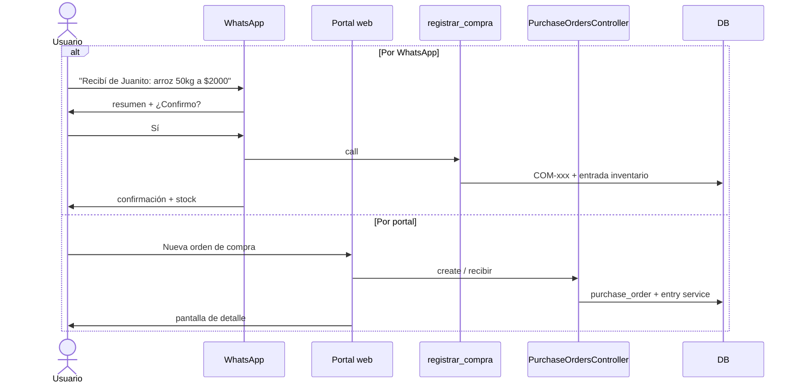
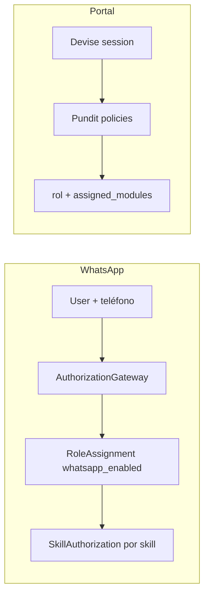
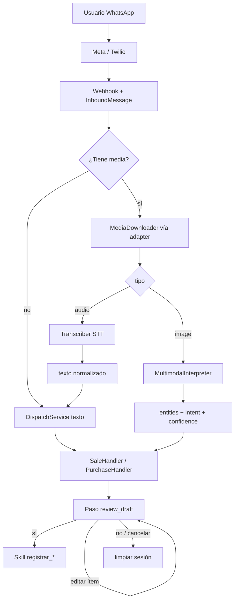

# Arquitectura WhatsApp — estado actual

Este documento describe la arquitectura **implementada** en Hermes. Parte de la evolución propuesta en el PR #6 (agente con skills, guardrails, auditoría e idempotencia; adapter de proveedor) y refleja lo que ya está en `main`.

Para el detalle de cada skill y ejemplos conversacionales, ver [whatsapp-skills.md](./whatsapp-skills.md).

---

## Visión

WhatsApp es un **cliente autorizado del dominio**, no una ruta especial que escribe directo a ActiveRecord. El flujo es:

1. Proveedor (Meta Cloud API por defecto; Twilio disponible) → contratos normalizados.
2. Identidad + tienda autorizada por admin.
3. Orquestación (sesión + regex o Interpreter LLM).
4. Handlers conversacionales con confirmación en escrituras.
5. **Skills** como única frontera de lectura/escritura del canal.
6. Respuestas deterministas vía `ResponseRenderer` → `Sender` → adapter.

El portal web sigue siendo el canal de administración (roles, CRUDs, importación Excel/CSV).

---

## Arquitectura end-to-end



---

## Capas implementadas (vs propuesta PR #6)

| Capacidad | Estado en main |
| --- | --- |
| Provider Adapter (Meta / Twilio) | ✅ `Providers::MetaAdapter`, `TwilioAdapter`, `Resolver` |
| Contratos `InboundMessage` / outbound | ✅ (incluye `media`; aún no se descarga ni interpreta) |
| Resolver de tienda + auth WhatsApp | ✅ `BusinessResolver`, `AuthorizationGateway` |
| Skills con permisos e idempotencia | ✅ 6 skills + `whatsapp_skill_executions` |
| Confirmación humana en escrituras | ✅ Handlers multi-turno (`sí` / `no` cancela sesión) |
| Edición de ítems en borrador | ⏳ quitar / cambiar qty-precio (plan media, Fase 1) |
| Audio / imagen → borrador | ⏳ plan abajo (STT + multimodal) |
| Auditoría de mensajes | ✅ `WhatsappMessageAudit` |
| Agente LLM por tienda | ✅ `businesses.whatsapp_agent` + Interpreter |
| Guard de confianza | ✅ `ConfidenceGuard` |
| Response renderer determinista | ✅ `ResponseRenderer` |
| Evals del interpreter | ✅ `docs/whatsapp-evals.md` |
| Skills pendientes de la propuesta | ⏳ `buscar_productos`, `consultar_cartera`, `registrar_ajuste_inventario` |

---

## Flujo de usuario: venta por WhatsApp



El mismo patrón aplica a **compras** (`registrar_compra`) y **pagos** (`registrar_pago`): borrador en sesión → confirmación → skill idempotente.

---

## Flujo de usuario: reporte (WhatsApp vs web)



- **WhatsApp:** resumen operativo inmediato en chat.
- **Web:** administración, detalle de órdenes y carga masiva de catálogo (Excel/CSV). Reportes contables PDF/Excel ampliados están planificados.

---

## Flujo de usuario: compra / orden de compra



---

## Autorización en dos canales



Detalle: [whatsapp-business-authorization.md](./whatsapp-business-authorization.md) y [autorizacion.md](./autorizacion.md).

---

## Configuración rápida

| Tema | Documento |
| --- | --- |
| Skills y ejemplos | [whatsapp-skills.md](./whatsapp-skills.md) |
| Regex vs LLM | [whatsapp-agent-switching.md](./whatsapp-agent-switching.md) |
| Meta vs Twilio | [whatsapp-provider-switching.md](./whatsapp-provider-switching.md) |
| Flujos conversacionales | [whatsapp-bot.md](./whatsapp-bot.md) |
| Evals del interpreter | [whatsapp-evals.md](./whatsapp-evals.md) |

---

## Principios vigentes

1. El agente (LLM) o el regex **interpretan**; las skills **ejecutan**.
2. Toda skill recibe `user`, `business`, `input` (y `idempotency_key` en escrituras); no se infiere el negocio con `owned_businesses.first`.
3. Escrituras exigen confirmación conversacional antes de llamar a la skill.
4. El dominio de inventario se reutiliza (`RecordInventoryExitService` / `RecordInventoryEntryService`).
5. Código de negocio no depende de parámetros específicos de Meta o Twilio: solo del adapter y de los contratos internos.

---

## Plan: audio e imágenes para órdenes (compra / venta)

Objetivo: que el usuario pueda dictar o fotografiar una compra/venta y el bot arme un **borrador listo para confirmar**, con posibilidad de corregir ítems o cancelar, sin rehacer el flujo campo a campo.

Hoy el adapter ya parsea `media` en `InboundMessage` (id, mime_type, caption), pero el webhook solo despacha `inbound.body`. Sin caption, un audio o imagen llega vacío al `DispatchService`. La cancelación básica (`no` / `cancelar`) ya limpia la sesión en handlers; falta documentarla y enriquecer la edición del borrador.

### UX objetivo

```text
# Audio (nota de voz)
Usuario → 🎤 "Recibí de Juanito arroz 50 kilos a dos mil y aceite 10 litros a ocho mil"
Bot     → Compra a Juanito:
           - Arroz 50kg × $2,000 = $100,000
           - Aceite 10L × $8,000 = $80,000
           Total: $180,000
           ¿Confirmo? (sí / no)
           También puedes: quitar aceite | cambiar precio arroz 1900 | cancelar
Usuario → Sí
Bot     → ✅ COM-xxx registrada. ...

# Imagen (foto de nota / factura / pizarra)
Usuario → 📷 [foto de lista] + caption opcional "compra de Don Pedro"
Bot     → Compra a Don Pedro:
           - ...
           ¿Confirmo? (sí / no) …

# Corrección o desistimiento
Usuario → quitar aceite
Bot     → Compra a Juanito:
           - Arroz 50kg × $2,000 = $100,000
           Total: $100,000. ¿Confirmo?
Usuario → cancelar
Bot     → Compra cancelada.
```

El mismo patrón aplica a **ventas** (cliente + condición de pago si el multimodal/STT los infiere; si no, preguntar solo lo faltante).

### Principio de diseño

| Capa | Responsabilidad |
| --- | --- |
| Media ingest | Descargar bytes del proveedor; normalizar a archivo temporal / blob |
| Audio → texto | STT (transcripción); el texto entra al flujo existente |
| Imagen → entidades | Modelo multimodal → mismas entidades que el Interpreter (`intent`, `items`, `supplier_name` / `customer_name`, …) |
| Handlers | Armar draft; **ir directo a confirmación** cuando la confianza y los datos sean suficientes |
| Skills | Sin cambios de frontera: solo escriben tras confirmación humana |

Audio e imagen **no** llaman a `registrar_compra` / `registrar_venta` por su cuenta: solo producen interpretación + draft.

### Arquitectura propuesta



### Estado actual vs gaps

| Capacidad | Hoy | Gap |
| --- | --- | --- |
| Parse de media en adapter | ✅ id / mime / caption | Descargar binario (`GET /{media-id}` en Meta; URL Twilio) |
| Paso de media al dispatch | ❌ solo `body` | Propagar `InboundMessage` o `media` + body efectivo |
| Cancelar borrador | ✅ `negative?` en collecting / confirm | Mensajes más claros; comando explícito `cancelar` en copy |
| Editar / quitar ítems del draft | ❌ solo agregar en compra | Comandos de revisión: quitar, cambiar qty/precio, cambiar proveedor/cliente |
| Atajo a confirmación | Parcial (venta con entidades completas) | Tras media de alta confianza → `awaiting_confirmation` |
| Audio | ❌ | `Media::Transcriber` + reutilizar Interpreter/regex |
| Imagen | ❌ (roadmap “OCR”) | `Media::MultimodalInterpreter` (visión + JSON schema) |

### Fases de implementación

#### Fase 0 — Contrato y descarga (infra)

1. Extender el contrato de media: `id`, `mime_type`, `caption`, `url` (Twilio), `kind` (`audio` / `image` / …).
2. `Providers::Base#download_media(media_ref) → tempfile` (Meta: token + media id; Twilio: URL autenticada).
3. Webhook: si hay media sin body útil, no despachar texto vacío; encolar o procesar ingest antes del handler.
4. Auditoría: guardar en metadata `media_kind`, `media_id`, duración/tamaño, sin persistir el binario en logs.

#### Fase 1 — Revisión de borrador (texto primero; desbloquea media)

Mejorar el flujo conversacional **antes** de depender de STT/visión. Aplica a compra y venta:

1. Paso unificado `awaiting_confirmation` (o `review_draft`) con copy explícito:
   - `sí` → skill
   - `no` / `cancelar` → limpiar sesión (`ResponseRenderer.cancelled`)
   - `quitar <producto>` / `eliminar ítem N`
   - `cambiar precio <producto> <monto>` / `cambiar cantidad …`
   - `proveedor X` / `cliente Y` (según intent)
2. Si faltan campos obligatorios tras la interpretación (ej. venta sin cliente), preguntar **solo** lo faltante; no reiniciar el carrito.
3. Documentar y cubrir con tests de handler (hoy el cancel existe pero no está en los ejemplos de producto).

Esta fase es la que hace “automático” el flujo: el usuario confirma o ajusta, no vuelve a dictar toda la orden.

#### Fase 2 — Audio → texto → mismo flujo

1. `WhatsappBot::Media::Transcriber` (OpenAI Whisper u API compatible; configurable por env).
2. Pipeline: download → STT → `effective_body = transcription` (+ caption si existe).
3. Despachar como mensaje de texto normal (regex o Interpreter según `business.whatsapp_agent`).
4. Si el Interpreter/entities traen ítems + contraparte suficientes → saltar a `awaiting_confirmation` con resumen.
5. Respuesta intermedia opcional mientras transcribe (“Escuchando tu nota…”) vía job async si la latencia supera ~2–3s (Solid Queue + reply de progreso).
6. Errores: audio vacío / idioma no soportado / STT fallido → mensaje claro pidiendo reintentar o escribir.

#### Fase 3 — Imagen → interpretación multimodal

1. `WhatsappBot::Media::MultimodalInterpreter` con el **mismo JSON schema** que `Interpreter` (intent + entities + confidence), más campos opcionales `source: image` y `notes` (texto ilegible, dudas).
2. Input: imagen (bytes o URL firmada) + caption + catálogo resumido de productos de la tienda (nombres) para anclar matching.
3. `ConfidenceGuard` reutilizado: baja confianza → pedir aclaración o caer a flujo de recolección de ítems; no escribir.
4. Matching de productos: reutilizar la lógica de handlers (`find_product`); si un renglón no matchea, listarlo como “no encontrado” y pedir corrección antes de confirmar.
5. Mismo destino que audio: draft → review (confirmar / editar / cancelar) → skill.

#### Fase 4 — Calidad, costos y rollout

1. Evals: casos de transcripción ficticia + fixtures de entidades desde “imagen” (golden JSON); no hace falta foto real en CI si se mockea el cliente multimodal.
2. Feature flags por tienda (ej. `businesses.whatsapp_media_ingest` o config YAML): audio / image independientes.
3. Límites: tamaño máximo, solo `audio/*` e `image/*`, timeout, costo por mensaje en audit.
4. Rollout: primero compras (mayor valor en “foto de remito”), luego ventas; regex-only shops pueden usar STT + patrones sin multimodal completo.

### Decisiones abiertas (resolver en implementación)

| Tema | Recomendación inicial |
| --- | --- |
| Sync vs async | Sync si &lt; ~3s; si no, job + “Procesando tu audio/foto…” |
| ¿Un solo modelo para imagen+intent? | Sí: multimodal con schema del Interpreter; evitar OCR crudo + segundo LLM salvo fallback |
| ¿Persistir media? | No en v1; solo metadata en audit. Active Storage solo si hay requisito de evidencia |
| Caption + media | Caption manda contexto (proveedor/cliente); la media aporta ítems |
| Documentos PDF | Fuera de v1; mismo hook `download_media` deja la puerta abierta |

### Criterios de aceptación (v1)

- Nota de voz de compra con 1–N ítems produce resumen y confirma con un `sí`.
- Foto de lista de compra produce el mismo resumen (con matching al catálogo).
- `cancelar` / `no` en cualquier paso de revisión no crea orden ni mueve inventario.
- `quitar <producto>` actualiza el draft y vuelve a pedir confirmación.
- Skills existentes sin cambios de firma; idempotency_key sigue siendo el `provider_message_id` del mensaje original (o del mensaje de confirmación, documentar una sola política).
- Tiendas sin flag de media se comportan como hoy (texto únicamente).
