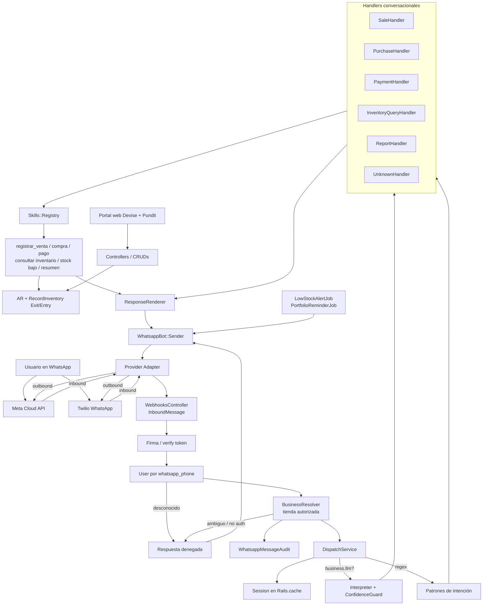
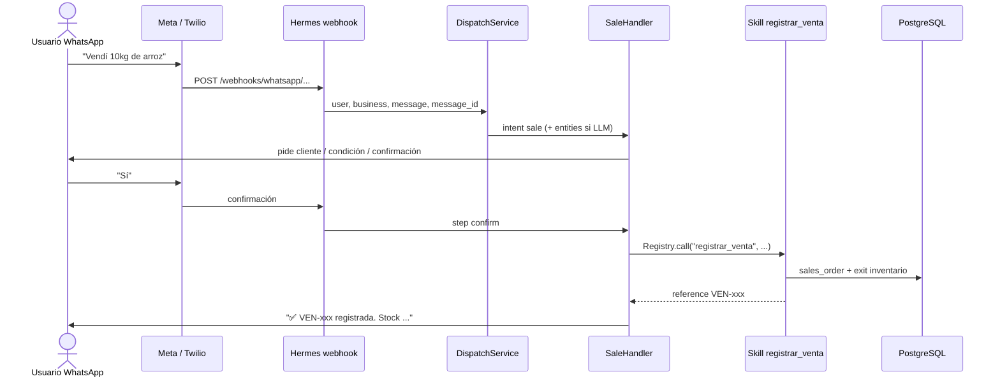
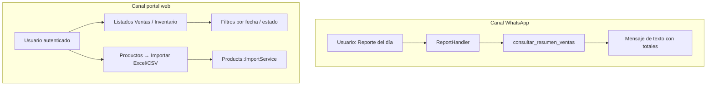
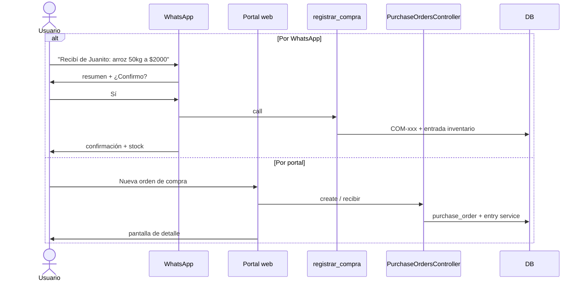
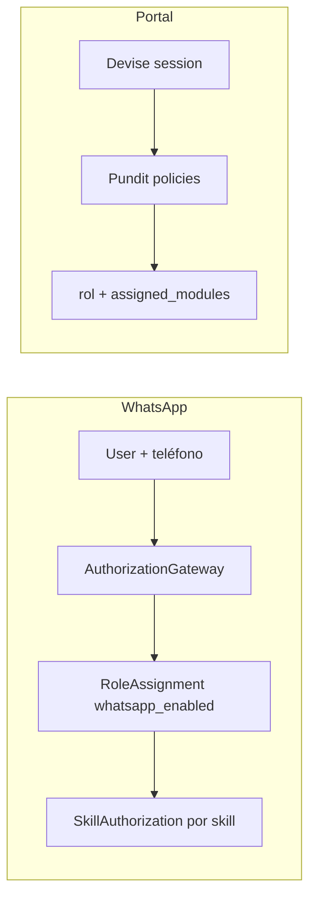

# Arquitectura WhatsApp — estado actual

Este documento describe la arquitectura **implementada** en Hermes. Parte de la evolución propuesta en el PR #6 (agente con skills, guardrails, auditoría e idempotencia; adapter de proveedor) y refleja lo que ya está en `main`.

Para el detalle de cada skill y ejemplos conversacionales, ver [whatsapp-skills.md](./whatsapp-skills.md).

---

## Visión

WhatsApp es un **cliente autorizado del dominio**, no una ruta especial que escribe directo a ActiveRecord. El flujo es:

1. Proveedor (Meta Cloud API por defecto; Twilio disponible) → contratos normalizados.
2. Identidad + tienda autorizada por admin.
3. Orquestación (sesión + regex o Interpreter LLM).
4. Handlers conversacionales con confirmación en escrituras.
5. **Skills** como única frontera de lectura/escritura del canal.
6. Respuestas deterministas vía `ResponseRenderer` → `Sender` → adapter.

El portal web sigue siendo el canal de administración (roles, CRUDs, importación Excel/CSV).

---

## Arquitectura end-to-end

---

## Capas implementadas (vs propuesta PR #6)

| Capacidad | Estado en main |
| --- | --- |
| Provider Adapter (Meta / Twilio) | ✅ `Providers::MetaAdapter`, `TwilioAdapter`, `Resolver` |
| Contratos `InboundMessage` / outbound | ✅ |
| Resolver de tienda + auth WhatsApp | ✅ `BusinessResolver`, `AuthorizationGateway` |
| Skills con permisos e idempotencia | ✅ 6 skills + `whatsapp_skill_executions` |
| Confirmación humana en escrituras | ✅ Handlers multi-turno |
| Auditoría de mensajes | ✅ `WhatsappMessageAudit` |
| Agente LLM por tienda | ✅ `businesses.whatsapp_agent` + Interpreter |
| Guard de confianza | ✅ `ConfidenceGuard` |
| Response renderer determinista | ✅ `ResponseRenderer` |
| Evals del interpreter | ✅ `docs/whatsapp-evals.md` |
| Skills pendientes de la propuesta | ⏳ `buscar_productos`, `consultar_cartera`, `registrar_ajuste_inventario` |

---

## Flujo de usuario: venta por WhatsApp

El mismo patrón aplica a **compras** (`registrar_compra`) y **pagos** (`registrar_pago`): borrador en sesión → confirmación → skill idempotente.

---

## Flujo de usuario: reporte (WhatsApp vs web)

- **WhatsApp:** resumen operativo inmediato en chat.
- **Web:** administración, detalle de órdenes y carga masiva de catálogo (Excel/CSV). Reportes contables PDF/Excel ampliados están planificados.

---

## Flujo de usuario: compra / orden de compra

---

## Autorización en dos canales

Detalle: [whatsapp-business-authorization.md](./whatsapp-business-authorization.md) y [autorizacion.md](./autorizacion.md).

---

## Configuración rápida

| Tema | Documento |
| --- | --- |
| Skills y ejemplos | [whatsapp-skills.md](./whatsapp-skills.md) |
| Regex vs LLM | [whatsapp-agent-switching.md](./whatsapp-agent-switching.md) |
| Meta vs Twilio | [whatsapp-provider-switching.md](./whatsapp-provider-switching.md) |
| Flujos conversacionales | [whatsapp-bot.md](./whatsapp-bot.md) |
| Evals del interpreter | [whatsapp-evals.md](./whatsapp-evals.md) |

---

## Principios vigentes

1. El agente (LLM) o el regex **interpretan**; las skills **ejecutan**.
2. Toda skill recibe `user`, `business`, `input` (y `idempotency_key` en escrituras); no se infiere el negocio con `owned_businesses.first`.
3. Escrituras exigen confirmación conversacional antes de llamar a la skill.
4. El dominio de inventario se reutiliza (`RecordInventoryExitService` / `RecordInventoryEntryService`).
5. Código de negocio no depende de parámetros específicos de Meta o Twilio: solo del adapter y de los contratos internos.
