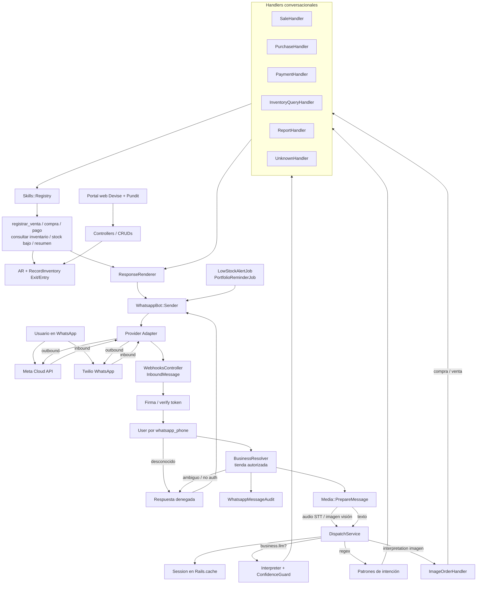
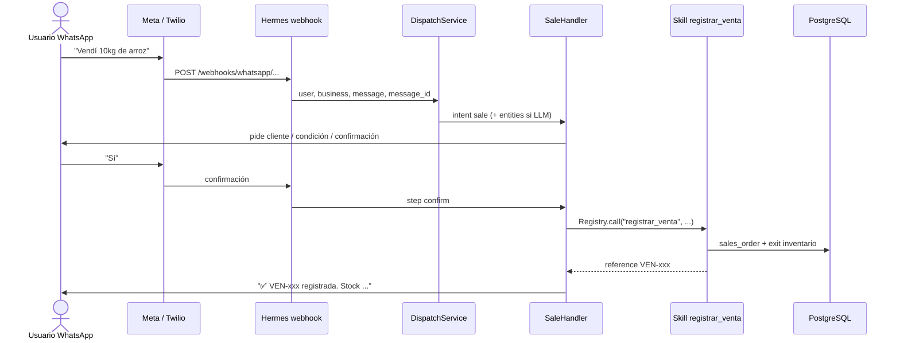
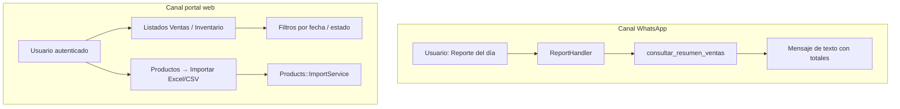
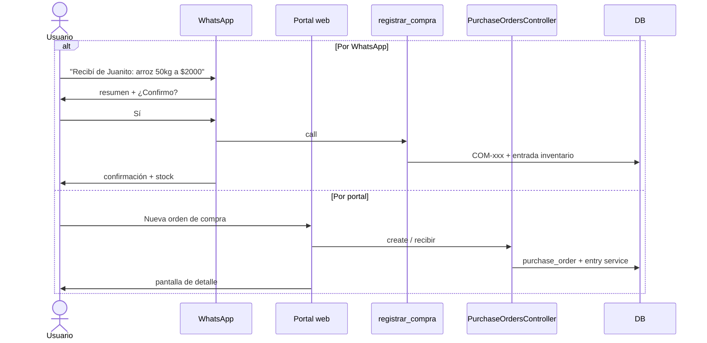
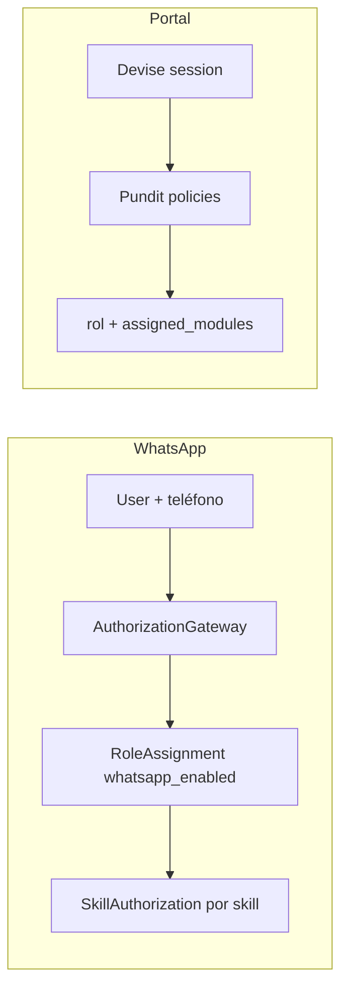
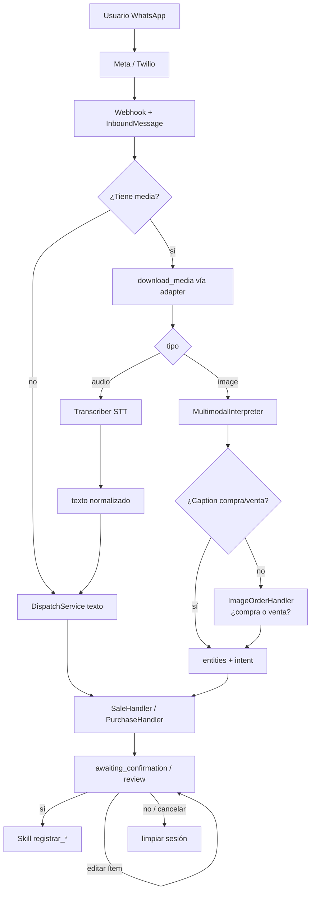

# Arquitectura WhatsApp — estado actual

Este documento describe la arquitectura **implementada** en Hermes. Parte de la evolución propuesta en el PR #6 (agente con skills, guardrails, auditoría e idempotencia; adapter de proveedor) y refleja lo que ya está en `main`.

Para el detalle de cada skill y ejemplos conversacionales, ver [whatsapp-skills.md](./whatsapp-skills.md).

---

## Visión

WhatsApp es un **cliente autorizado del dominio**, no una ruta especial que escribe directo a ActiveRecord. El flujo es:

1. Proveedor (Meta Cloud API por defecto; Twilio disponible) → contratos normalizados.
2. Identidad + tienda autorizada por admin.
3. Orquestación (sesión + regex o Interpreter LLM).
4. Handlers conversacionales con confirmación en escrituras.
5. **Skills** como única frontera de lectura/escritura del canal.
6. Respuestas deterministas vía `ResponseRenderer` → `Sender` → adapter.

El portal web sigue siendo el canal de administración (roles, CRUDs, importación Excel/CSV).

---

## Arquitectura end-to-end


```mermaid
flowchart TD
  U[Usuario en WhatsApp] --> Meta[Meta Cloud API]
  U --> Twilio[Twilio WhatsApp]
  Meta -->|inbound| GW[Provider Adapter]
  Twilio -->|inbound| GW
  GW --> WH[WebhooksController<br/>InboundMessage]
  WH --> Verify[Firma / verify token]
  Verify --> Identity[User por whatsapp_phone]
  Identity -->|desconocido| Deny[Respuesta denegada]
  Identity --> Store[BusinessResolver<br/>tienda autorizada]
  Store -->|ambiguo / no auth| Deny
  Store --> Audit[WhatsappMessageAudit]
  Store --> Media[Media::PrepareMessage]
  Media -->|audio STT / imagen visión| Orch[DispatchService]
  Media -->|texto| Orch
  Orch --> Mem[Session en Rails.cache]
  Orch -->|business.llm?| LLM[Interpreter + ConfidenceGuard]
  Orch -->|regex| Regex[Patrones de intención]
  Orch -->|interpretation imagen| ImgKind[ImageOrderHandler]
  LLM --> Handlers
  Regex --> Handlers
  ImgKind -->|compra / venta| Handlers

  subgraph Handlers[Handlers conversacionales]
    Sale[SaleHandler]
    Purchase[PurchaseHandler]
    Payment[PaymentHandler]
    Inv[InventoryQueryHandler]
    Report[ReportHandler]
    Unknown[UnknownHandler]
  end

  Handlers --> Registry[Skills::Registry]
  Registry --> Skills[registrar_venta / compra / pago<br/>consultar inventario / stock bajo / resumen]
  Skills --> Domain[AR + RecordInventory Exit/Entry]
  Handlers --> RR[ResponseRenderer]
  Skills --> RR
  RR --> Sender[WhatsappBot::Sender]
  Sender --> GW
  GW -->|outbound| Meta
  GW -->|outbound| Twilio
  Deny --> Sender

  Jobs[LowStockAlertJob<br/>PortfolioReminderJob] --> Sender

  Web[Portal web Devise + Pundit] --> DomainWeb[Controllers / CRUDs]
  DomainWeb --> Domain
```

---

## Capas implementadas (vs propuesta PR #6)

| Capacidad | Estado en main |
| --- | --- |
| Provider Adapter (Meta / Twilio) | ✅ `Providers::MetaAdapter`, `TwilioAdapter`, `Resolver` |
| Contratos `InboundMessage` / outbound | ✅ (incluye `media` + `download_media`) |
| Resolver de tienda + auth WhatsApp | ✅ `BusinessResolver`, `AuthorizationGateway` |
| Skills con permisos e idempotencia | ✅ 6 skills + `whatsapp_skill_executions` |
| Confirmación humana en escrituras | ✅ Handlers multi-turno (`sí` / `no` cancela sesión) |
| Edición de ítems en borrador | ✅ `DraftCommands` (quitar / cambiar precio / proveedor / cliente) |
| Audio → texto → borrador | ✅ `Media::Transcriber` + Interpreter/handlers |
| Imagen → entidades → borrador | ✅ `Media::MultimodalInterpreter` + `ImageOrderHandler` |
| Auditoría de mensajes | ✅ `WhatsappMessageAudit` |
| Agente LLM por tienda | ✅ `businesses.whatsapp_agent` + Interpreter |
| Guard de confianza | ✅ `ConfidenceGuard` |
| Response renderer determinista | ✅ `ResponseRenderer` |
| Evals del interpreter | ✅ `docs/whatsapp-evals.md` |
| Skills pendientes de la propuesta | ⏳ `buscar_productos`, `consultar_cartera`, `registrar_ajuste_inventario` |

---

## Flujo de usuario: venta por WhatsApp


```mermaid
sequenceDiagram
  actor U as Usuario WhatsApp
  participant M as Meta / Twilio
  participant W as Hermes webhook
  participant D as DispatchService
  participant H as SaleHandler
  participant S as Skill registrar_venta
  participant DB as PostgreSQL

  U->>M: "Vendí 10kg de arroz"
  M->>W: POST /webhooks/whatsapp/...
  W->>D: user, business, message, message_id
  D->>H: intent sale (+ entities si LLM)
  H->>U: pide cliente / condición / confirmación
  U->>M: "Sí"
  M->>W: confirmación
  W->>H: step confirm
  H->>S: Registry.call("registrar_venta", ...)
  S->>DB: sales_order + exit inventario
  S-->>H: reference VEN-xxx
  H->>U: "✅ VEN-xxx registrada. Stock ..."
```

El mismo patrón aplica a **compras** (`registrar_compra`) y **pagos** (`registrar_pago`): borrador en sesión → confirmación → skill idempotente.

---

## Flujo de usuario: reporte (WhatsApp vs web)


```mermaid
flowchart TB
  subgraph WA[Canal WhatsApp]
    A1[Usuario: Reporte del día] --> A2[ReportHandler]
    A2 --> A3[consultar_resumen_ventas]
    A3 --> A4[Mensaje de texto con totales]
  end

  subgraph WEB[Canal portal web]
    B1[Usuario autenticado] --> B2[Listados Ventas / Inventario]
    B2 --> B3[Filtros por fecha / estado]
    B1 --> B4[Productos → Importar Excel/CSV]
    B4 --> B5[Products::ImportService]
  end
```

- **WhatsApp:** resumen operativo inmediato en chat.
- **Web:** administración, detalle de órdenes y carga masiva de catálogo (Excel/CSV). Reportes contables PDF/Excel ampliados están planificados.

---

## Flujo de usuario: compra / orden de compra


```mermaid
sequenceDiagram
  actor U as Usuario
  participant WA as WhatsApp
  participant Web as Portal web
  participant Skill as registrar_compra
  participant Ctrl as PurchaseOrdersController
  participant DB as DB

  alt Por WhatsApp
    U->>WA: "Recibí de Juanito: arroz 50kg a $2000"
    WA->>U: resumen + ¿Confirmo?
    U->>WA: Sí
    WA->>Skill: call
    Skill->>DB: COM-xxx + entrada inventario
    WA->>U: confirmación + stock
  else Por portal
    U->>Web: Nueva orden de compra
    Web->>Ctrl: create / recibir
    Ctrl->>DB: purchase_order + entry service
    Web->>U: pantalla de detalle
  end
```

---

## Autorización en dos canales


```mermaid
flowchart LR
  subgraph WhatsApp
    WU[User + teléfono] --> WG[AuthorizationGateway]
    WG --> WR[RoleAssignment whatsapp_enabled]
    WR --> WS[SkillAuthorization por skill]
  end

  subgraph Portal
    PU[Devise session] --> PP[Pundit policies]
    PP --> PM[rol + assigned_modules]
  end
```

Detalle: [whatsapp-business-authorization.md](./whatsapp-business-authorization.md) y [autorizacion.md](./autorizacion.md).

---

## Configuración rápida

| Tema | Documento |
| --- | --- |
| Skills y ejemplos | [whatsapp-skills.md](./whatsapp-skills.md) |
| Regex vs LLM | [whatsapp-agent-switching.md](./whatsapp-agent-switching.md) |
| Meta vs Twilio | [whatsapp-provider-switching.md](./whatsapp-provider-switching.md) |
| Flujos conversacionales | [whatsapp-bot.md](./whatsapp-bot.md) |
| Evals del interpreter | [whatsapp-evals.md](./whatsapp-evals.md) |

---

## Principios vigentes

1. El agente (LLM) o el regex **interpretan**; las skills **ejecutan**.
2. Toda skill recibe `user`, `business`, `input` (y `idempotency_key` en escrituras); no se infiere el negocio con `owned_businesses.first`.
3. Escrituras exigen confirmación conversacional antes de llamar a la skill.
4. El dominio de inventario se reutiliza (`RecordInventoryExitService` / `RecordInventoryEntryService`).
5. Código de negocio no depende de parámetros específicos de Meta o Twilio: solo del adapter y de los contratos internos.

---

## Audio e imágenes para órdenes (compra / venta)

Implementado: el usuario puede **dictar** o **fotografiar** una compra/venta; el bot arma un borrador, pide lo faltante (incluido compra vs venta en fotos sin caption) y solo escribe tras confirmación humana.

Detalle de configuración y ejemplos: [whatsapp-bot.md](./whatsapp-bot.md#audio-e-imágenes).

### UX

```text
# Audio (nota de voz)
Usuario → 🎤 "Recibí de Juanito arroz 50 kilos a dos mil y aceite 10 litros a ocho mil"
Bot     → Compra a Juanito:
           - Arroz 50kg × $2,000 = $100,000
           - Aceite 10L × $8,000 = $80,000
           Total: $180,000
           ¿Confirmo? (sí / no)
           También puedes: quitar aceite | cambiar precio arroz 1900 | cancelar
Usuario → Sí
Bot     → ✅ COM-xxx registrada. ...

# Imagen (foto de nota / factura / pizarra)
Usuario → 📷 [foto de lista]   # la foto aporta ítems/precios
Bot     → Leí esto de la foto:
           - Arroz 50kg a $2,000
           ¿Es *compra* o *venta*?
Usuario → compra
Bot     → Compra a Proveedor:
           - ...
           ¿Confirmo? (sí / no) …

# Corrección o desistimiento
Usuario → quitar aceite
Bot     → … ¿Confirmo?
Usuario → cancelar
Bot     → Compra cancelada.
```

En ventas, tras la interpretación se piden cliente y condición de pago si faltan. Caption claro (`compra` / `venta`) puede saltar la pregunta de tipo de orden.

### Capas

| Capa | Responsabilidad | Componentes |
| --- | --- | --- |
| Media ingest | Descargar bytes; tempfile; metadata en audit | `Providers::*#download_media`, `Media::PrepareMessage` |
| Audio → texto | STT; el texto entra al flujo existente | `Media::Transcriber` (OpenAI / Groq / fake) |
| Imagen → entidades | Visión → JSON del Interpreter (`items`, precios, …) | `Media::MultimodalInterpreter`, `OpenAiVisionClient` |
| Tipo de orden (foto) | Sin caption claro → preguntar compra/venta | `Media::ImageOrderKind`, `ImageOrderHandler` |
| Handlers | Draft + revisión (confirmar / editar / cancelar) | `SaleHandler`, `PurchaseHandler`, `DraftCommands` |
| Skills | Solo escriben tras confirmación | `registrar_compra` / `registrar_venta` |

Audio e imagen **no** llaman a las skills por su cuenta: solo producen interpretación + draft.

### Flujo de media


```mermaid
flowchart TD
  U[Usuario WhatsApp] --> P[Meta / Twilio]
  P --> WH[Webhook + InboundMessage]
  WH --> MI{¿Tiene media?}
  MI -->|no| D[DispatchService texto]
  MI -->|sí| DL[download_media vía adapter]
  DL --> K{tipo}
  K -->|audio| STT[Transcriber STT]
  K -->|image| MM[MultimodalInterpreter]
  STT --> TXT[texto normalizado]
  MM --> KIND{¿Caption compra/venta?}
  KIND -->|sí| ENT[entities + intent]
  KIND -->|no| ASK[ImageOrderHandler<br/>¿compra o venta?]
  ASK --> ENT
  TXT --> D
  ENT --> H[SaleHandler / PurchaseHandler]
  D --> H
  H --> REV[awaiting_confirmation / review]
  REV -->|sí| SK[Skill registrar_*]
  REV -->|editar ítem| REV
  REV -->|no / cancelar| CLR[limpiar sesión]
```

### Decisiones tomadas

| Tema | Decisión |
| --- | --- |
| Sync vs async | Sync en v1 (webhook procesa STT/visión inline) |
| Modelo de imagen | Un multimodal con schema del Interpreter; sin OCR crudo + segundo LLM |
| Persistencia de media | No; solo metadata en `WhatsappMessageAudit` |
| Caption + foto | La foto aporta ítems/precios; compra vs venta por chat (o caption claro) |
| Feature flags | `media.audio_enabled` / `media.image_enabled` en `config/whatsapp.yml` |
| Documentos PDF | Fuera de v1; el hook `download_media` deja la puerta abierta |

### Pendiente (mejoras)

- Mensaje intermedio async (“Procesando tu audio/foto…”) si la latencia es alta
- Flags de media por tienda (hoy son globales por entorno en YAML)
- Evals golden específicos de visión (hoy se mockea el cliente en tests)
