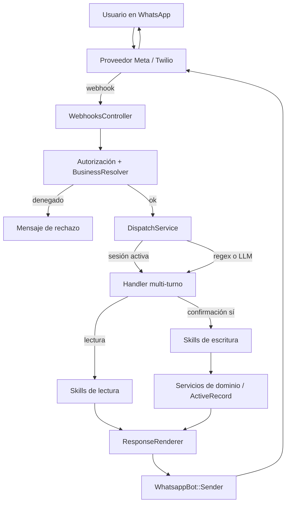
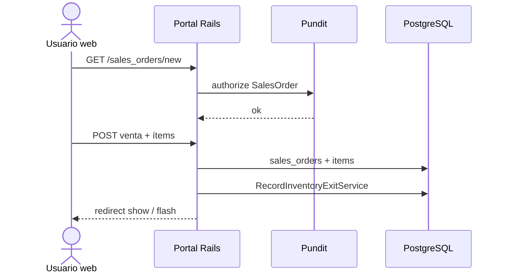
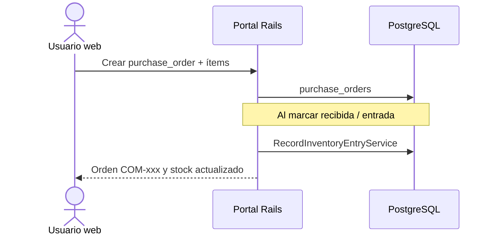
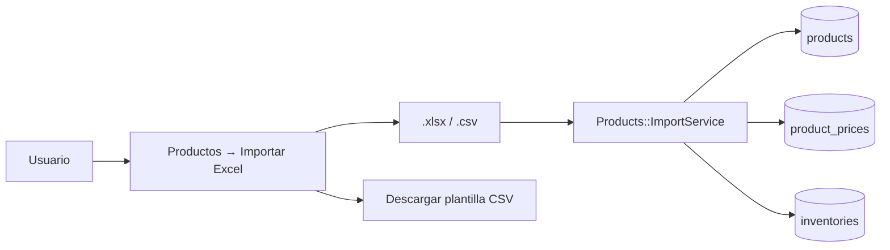

# Skills de WhatsApp

Las skills son la frontera de lectura/escritura del bot. Los handlers (regex o Interpreter LLM) y el portal web no comparten el mismo código de persistencia, pero las skills de WhatsApp encapsulan las operaciones operativas que el canal conversacional puede ejecutar: registrar ventas, compras y pagos, consultar inventario y resumen del día.

Handlers y (cuando aplica) el AI Agent **no** persisten datos directamente: invocan skills registradas en `WhatsappBot::Skills::Registry`.

## Contrato

```ruby
WhatsappBot::Skills::Registry.call(
  "registrar_venta",
  user: user,
  business: business,
  input: { ... },
  idempotency_key: "#{provider_message_id}:registrar_venta"
)
```

Retorna `WhatsappBot::Skills::Base::Result` con `success?`, `data`, `errors` y `idempotent_replay`.

## Flujo: mensaje → skill → dominio



---

## Skills disponibles

| Nombre | Tipo | Clase | Qué hace |
| --- | --- | --- | --- |
| `registrar_venta` | Escritura | `Skills::RegisterSale` | Crea `SalesOrder` + ítems, descuenta inventario |
| `registrar_compra` | Escritura | `Skills::RegisterPurchase` | Crea `PurchaseOrder` recibida + ítems, aumenta inventario |
| `registrar_pago` | Escritura | `Skills::RegisterPayment` | Registra abono sobre una venta a crédito |
| `consultar_inventario` | Lectura | `Skills::QueryInventory` | Stock de un producto por nombre |
| `listar_stock_bajo` | Lectura | `Skills::ListLowStock` | Productos bajo el mínimo de alerta |
| `consultar_resumen_ventas` | Lectura | `Skills::SalesReport` | Resumen del día + cartera pendiente |

---

## Descripción de cada skill

### `registrar_venta`

Registra una orden de venta en la tienda operativa. Soporta **un ítem** (input legado) o **varios ítems** vía `input[:items]`.

**Input típico**

```ruby
{
  customer_name: "Don Julio",
  payment_condition: "cash", # o "credit"
  items: [
    { product_id: 1, quantity: 10, unit_price: 2500 },
    { product_id: 2, quantity: 5, unit_price: 7500 }
  ]
}
```

**Efectos**

- Crea `sales_orders` + `sales_order_items` (snapshot de precio).
- Llama a `SalesOrders::RecordInventoryExitService`.
- Referencia tipo `VEN-001`.
- Idempotente si se pasa `idempotency_key`.

**Respuesta WhatsApp (vía renderer)**

```text
✅ VEN-001 registrada. Stock Arroz: 90kg Stock Aceite: 35lt
```

---

### `registrar_compra`

Registra una orden de compra **recibida** (entrada de mercancía). Exige `supplier_name` y al menos un ítem válido.

**Input típico**

```ruby
{
  supplier_name: "Juanito",
  items: [
    { product_id: 1, quantity: 50, unit_price: 2000 }
  ]
}
```

**Efectos**

- Crea `purchase_orders` (`status: received`) + ítems.
- Llama a `PurchaseOrders::RecordInventoryEntryService`.
- Referencia tipo `COM-001`.

**Respuesta WhatsApp**

```text
✅ COM-001 registrada. Stock Arroz: 140kg
```

---

### `registrar_pago`

Registra un abono de cartera contra una venta a crédito existente.

**Input típico**

```ruby
{
  order_id: 42,
  amount: 10_000
}
```

**Efectos**

- Crea `payments` y actualiza `payment_status` de la venta (`partial` / `paid`).
- Solo `owner` y `manager` (ver permisos).

**Respuesta WhatsApp**

```text
✅ Pago registrado. Saldo pendiente María: $2,500
```

---

### `consultar_inventario`

Busca inventario por nombre de producto (LIKE, case-insensitive) en la tienda.

**Input:** `{ product_name: "arroz" }`

**Respuesta WhatsApp**

```text
Arroz: 90kg ✅ (mín. 20)
```

o con alerta:

```text
Aceite: 3lt ⚠️ (mín. 10)
```

---

### `listar_stock_bajo`

Lista todos los inventarios de la tienda donde `current_quantity < minimum_alert_quantity`.

**Respuesta WhatsApp**

```text
⚠️ Productos bajo mínimo:
- Aceite: 3lt (mín. 10)
- Sal: 2kg (mín. 5)
```

Si no hay ninguno: `✅ Todo el stock está sobre los mínimos.`

---

### `consultar_resumen_ventas`

Agrega ventas **del día actual** y cartera pendiente de crédito. Hoy se entrega como **mensaje de texto** en WhatsApp (no genera Excel). La exportación tabular (CSV/Excel) vive en el portal web (p. ej. importación de productos).

**Datos en `result.data`**

| Campo | Significado |
| --- | --- |
| `count` / `total` | Cantidad y monto de ventas de hoy |
| `cash` / `credit` | Totales por condición de pago |
| `pending_portfolio` | Cartera crédito pendiente/parcial |
| `low_stock_count` | Productos bajo mínimo |

**Respuesta WhatsApp**

```text
📊 Resumen del día 20/07:
- Ventas: 12 (total $450,000)
  • Contado: $320,000
  • Crédito: $130,000
- Cartera total pendiente: $85,000
⚠️ 2 productos bajo mínimo
```

---

## Ejemplos conversacionales (WhatsApp)

### Venta al contado (un ítem)

```text
Usuario → Vendí 10kg de arroz
Bot     → 10kg de Arroz × $2,500 = $25,000. ¿A quién? (nombre o 'venta general')
Usuario → Don Julio
Bot     → Venta a Don Julio. ¿Contado o crédito?
Usuario → Contado
Bot     → Venta a Don Julio: 10kg Arroz = $25,000 (contado). ¿Confirmo? (sí/no)
Usuario → Sí
Bot     → ✅ VEN-001 registrada. Stock Arroz: 90kg
```

En la confirmación el handler invoca `registrar_venta`.

### Venta multi-ítem

```text
Usuario → Vendí 10kg arroz y 5lt aceite
Bot     → - 10kg Arroz = $25,000
           - 5lt Aceite = $37,500
           Total: $62,500. ¿A quién? ...
```

### Venta a crédito

```text
Usuario → Fiado a María 5kg arroz
Bot     → ... ¿Confirmo?
Usuario → Sí
Bot     → ✅ VEN-002 registrada. ...
```

### Orden de compra

```text
Usuario → Recibí de Juanito: arroz 50kg a $2,000
Bot     → Compra a Juanito:
           - Arroz 50kg: $100,000
           Total: $100,000. ¿Confirmo?
Usuario → Sí
Bot     → ✅ COM-001 registrada. Stock Arroz: 140kg
```

Flujo multi-ítem: el bot puede pedir más productos y el usuario escribe `listo` para confirmar; entonces se llama `registrar_compra`.

### Pago de cartera

```text
Usuario → María pagó $10,000
Bot     → María tiene saldo de $12,500 (VEN-002). Abono de $10,000.
           Saldo pendiente: $2,500. ¿Confirmo?
Usuario → Sí
Bot     → ✅ Pago registrado. Saldo pendiente María: $2,500
```

### Reporte del día

```text
Usuario → Reporte del día
Bot     → 📊 Resumen del día 20/07: ...
```

Invoca `consultar_resumen_ventas` (solo lectura; sin confirmación).

---

## Portal web: mismos dominios, otro canal

Las skills cubren la operación diaria por WhatsApp. El portal Rails ofrece el CRUD equivalente y capacidades de administración/carga masiva:

| Dominio | WhatsApp (skill) | Portal web |
| --- | --- | --- |
| Ventas | `registrar_venta` | `SalesOrdersController` |
| Compras | `registrar_compra` | `PurchaseOrdersController` |
| Pagos | `registrar_pago` | `PaymentsController` |
| Inventario | `consultar_*` / `listar_*` | `InventoriesController` |
| Reporte del día | mensaje vía `consultar_resumen_ventas` | listados / filtros en ventas |
| Catálogo masivo | — | Importar productos **Excel/CSV** (`ProductsController#import`) |

### Flujo web: registrar venta



### Flujo web: orden de compra



### Flujo web: importar productos (Excel/CSV)



Plantilla CSV: `nombre`, `descripcion`, `unidad_medida`, `precio_venta`, `precio_compra`, `stock_inicial`, `stock_minimo`.

> El reporte operativo por WhatsApp es **mensaje de texto**. La carga masiva y plantillas tabulares están en el **portal** (Excel/CSV de productos). Exportaciones contables PDF/Excel más amplias siguen en roadmap.

---

## Permisos

Toda ejecución valida primero que el usuario esté activo, tenga acceso a la tienda y esté autorizado para WhatsApp (`AuthorizationGateway`). Luego `SkillAuthorization` aplica permisos por rol:

| Rol | Skills |
| --- | --- |
| `owner` / `manager` | Todas |
| `operator` | Lectura; `registrar_venta` si módulo `sales`; `registrar_compra` si módulo `purchases` |
| `viewer` | Solo lectura |
| `registrar_pago` | Solo `owner` y `manager` |

`assigned_modules` usa nombres separados por coma, por ejemplo `sales,purchases`. Una revocación de usuario, tienda, rol o canal también bloquea el replay de una ejecución idempotente.

---

## Idempotencia

Las skills de escritura guardan el resultado en `whatsapp_skill_executions` indexado por `idempotency_key` (único). Si el proveedor reenvía el mismo mensaje, se devuelve el resultado anterior sin duplicar órdenes ni pagos.

Clave recomendada: `{provider_message_id}:{skill_name}`.

Las skills de lectura no persisten ejecución idempotente; solo pasan por `authorize_skill!`.

---

## Relacionado

- [Arquitectura WhatsApp (estado actual)](./whatsapp-architecture.md)
- [Diseño del bot y flujos](./whatsapp-bot.md)
- [Autorización de tiendas](./whatsapp-business-authorization.md)
- [Cambio de agente regex/LLM](./whatsapp-agent-switching.md)
- [Cambio de proveedor](./whatsapp-provider-switching.md)
